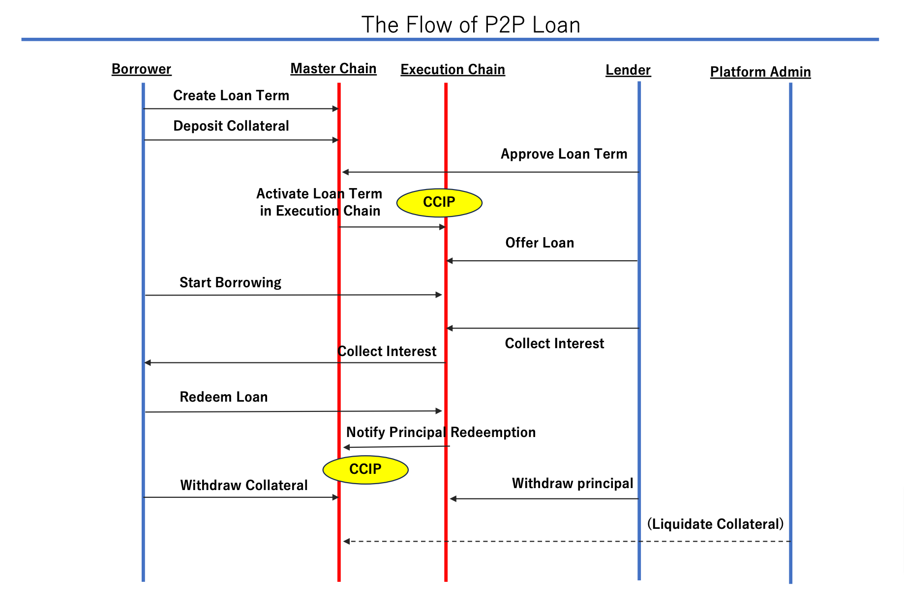
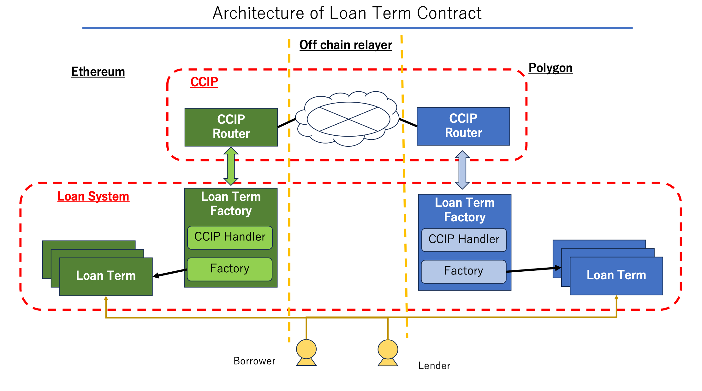

# CCIP P2P Loan Application
## Overview
This is P2P Loan application having cross chain capability. 
Assuming the situation where a borrower has good valued NFT on ethereum chain (most of high-end NFT resides on Ethereum at the moment), 
he would like to borrower USD token on L2(such as polygon) for the cheaper transaction cost. 

We offer the solution by only creating term contract and locking collateral NFT will be done in L1, 
then the rest of transaction tasks for loan execution and repayment will be delegated to L2.
The loan flow of our system will be like following chart.


Since cross chain message takes some time to complete due to necessity of waiting for the transaction finality, 
this should not be applied on time-sensitive or frequently used operations.   
We identify the use case for coordinating locked collateral and loan fund repayment status.
This is not time-sensitive and happened only limited number for each loan term process. 

## Architecture
The contract architecture with Chainlink CCIP is  shown in the diagram below.



- CCIP Router   
This contract is the contact point of Chainlink CCIP system. All messages are handled by this contract.
- P2PLoanTermFactory  
This contract has two features. One is CCIP Handler which acts as contact point to/from CCIP Router.
All CCIP messages of our system will be handled through this single contract.
Another feature is factory which create Loan Term contract upon request.
The factory manage the relationship between master chain and execution chain for each Loan Term and facilitate/validate the cross-chain message requests.
- P2PLoanTerm  
Individual Loan Term contract interacting with each borrower and lender pair for locking NFT collateral 
or facilitating with lending and redeeming operation


## Set up
Set up the project with following command
```
npm install
```

Then deploy the contract on each network. 
For example, if deploy on both sepolia and mumbai, run following command
```
npx hardhat run scripts/deployP2PLoanTermFactory.ts --network ethereumSepolia
npx hardhat run scripts/deployP2PLoanTermFactory.ts --network polygonMumbai
```
After that initial configuration is required. 
Please note that you need to set up the contract addresses created in previous step before executing following command. 
```
npx hardhat run scripts/setupCrossChainConfig.ts --network ethereumSepolia
npx hardhat run scripts/setupCrossChainConfig.ts --network polygonMumbai
```
Verify P2PLoanTermFactory with following commands
```
npx hardhat verify --network polygonMumbai --constructor-args ./scripts/verifyArgument/polygonArgument.js 0x95adE6BCD887eF2Ec71C0e3755a3Fc18B816ceBf
npx hardhat verify --network ethereumSepolia --constructor-args ./scripts/verifyArgument/argument.js 0x72e73Fd517c1aac629604fa54008cd1c6F08F585 
```
After Deploying the P2PLoanTermFactory contract, add LINK token to that contract for cross chain message fee.
(In production, charge it to user instead paying from contract's asset.)

## Testing
Test Scripts are available under test folder. Note that in order to perfrom CCIP (send or receive) test, 
We need to have CCIP router, so that using hardhat forking network is required. 

## Findings
1. Gas limitation  

The default gas limit for cross message handling is just 200,000. We need to specify the max limit by extraArgs parameter on EVM2AnyMessage.
Our ActivateLoanTerm message required over 2,000,000 gas cost. So parameter configuration was required.  

2. Interface pre-check  

On destination check CCIP router will perform pre-check if receiver contract will support a specific interface.
the contract should implement following logic in suppotsInteface function.
> interfaceId == type(IAny2EVMMessageReceiver).interfaceId || interfaceId == type(IERC165).interfaceId 

I have overwrote ccipReceive function with my custom Interface, this would essentially support ccipReceive 
But due to this, the pre-check of ccipRouter was failed and the message was not sent to receive contract.  
Note that in case inteface pre-check was failed, CCIP explore will show "success" and silently finish the process. 

3. Function Signature with enum 

In function signature, if the parameters of function used enum type, needed to specify the actual data type of enum value.
In our case, PayFeesIn struct argument data type should be specified as uint8. 


Overall, there a couple of error-prone items which you could only find in live-net test, which took some effort and time to resolve it. 
